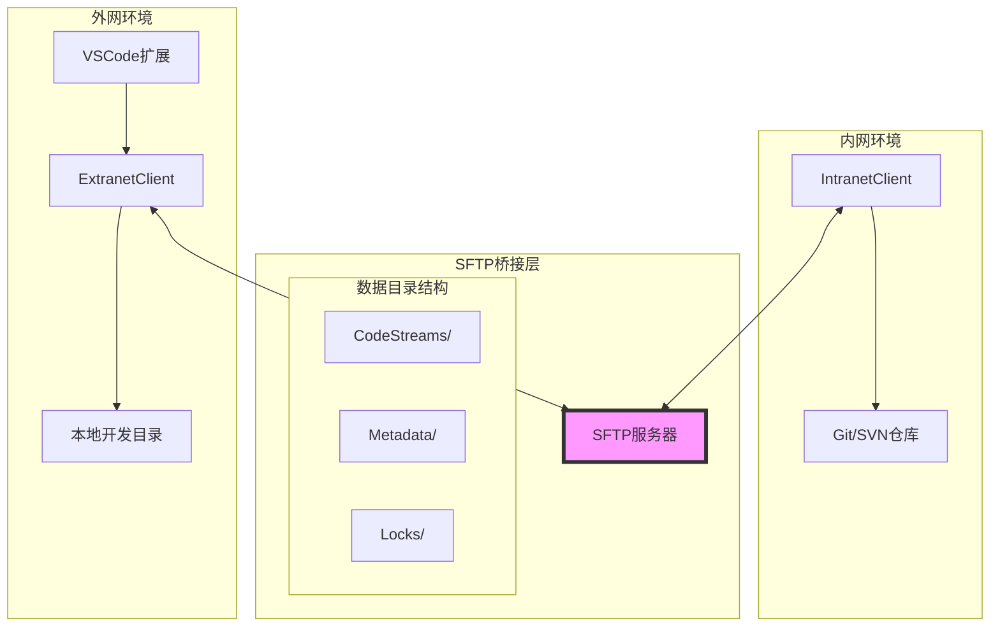

# 设计文档

## 概述

代码同步桥接服务采用分布式架构，通过SFTP服务器作为内外网通信的唯一桥梁。系统包含内网客户端、外网客户端、SFTP桥接服务器和VSCode扩展四个主要组件。采用基于文件的消息传递机制和增量同步策略，确保代码在内外网环境间的可靠传输。

## 架构

### 系统架构图



### 数据流架构

1. **注册流程**: 内网客户端 → 本地VCS → SFTP上传 → 元数据注册
2. **拉取流程**: 外网客户端 → SFTP下载 → 本地解压 → Git初始化
3. **提交流程**: 外网客户端 → 差异计算 → SFTP上传 → 内网监控同步
4. **同步流程**: 内网定时监控 → SFTP检查 → 下载应用 → VCS提交

## 组件和接口

### 1. IntranetClient (内网客户端)

**核心职责:**
- 代码流注册和管理
- 定时监控外网变更
- 自动同步到内网VCS

**主要接口:**
```typescript
interface IntranetClient {
  registerCodeStream(repoUrl: string, streamName: string): Promise<string>
  startMonitoring(streamId: string, interval: number): void
  syncChangesFromSFTP(streamId: string): Promise<SyncResult>
  uploadToSFTP(streamId: string, data: Buffer): Promise<void>
}
```

**关键模块:**
- `RepositoryManager`: 处理Git/SVN操作
- `SFTPUploader`: 管理SFTP上传
- `ChangeMonitor`: 监控外网变更
- `ConflictResolver`: 处理合并冲突

### 2. ExtranetClient (外网客户端)

**核心职责:**
- 拉取已注册的代码流
- 提交本地变更到SFTP
- 管理本地代码状态

**主要接口:**
```typescript
interface ExtranetClient {
  listAvailableStreams(): Promise<CodeStream[]>
  pullCodeStream(streamId: string, localPath: string): Promise<void>
  pushChanges(streamId: string, changes: FileChange[]): Promise<void>
  getStreamStatus(streamId: string): Promise<StreamStatus>
}
```

**关键模块:**
- `SFTPDownloader`: 管理SFTP下载
- `DiffCalculator`: 计算文件差异
- `LocalGitManager`: 管理本地Git仓库
- `ChangeTracker`: 跟踪文件变更

### 3. SFTPBridge (SFTP桥接服务)

**目录结构设计:**
```
/code-sync-bridge/
├── streams/
│   ├── {stream-id}/
│   │   ├── code.zip          # 完整代码包
│   │   ├── changes/          # 增量变更
│   │   │   ├── {timestamp}.patch
│   │   └── metadata.json     # 流元数据
├── locks/
│   └── {stream-id}.lock      # 操作锁文件
└── config/
    └── bridge.json           # 桥接配置
```

**元数据格式:**
```json
{
  "streamId": "unique-stream-id",
  "name": "project-name",
  "repoType": "git|svn",
  "repoUrl": "internal-repo-url",
  "lastSync": "2024-01-01T00:00:00Z",
  "version": "1.0.0",
  "status": "active|paused|archived"
}
```

### 4. VSCode扩展

**功能模块:**
- `StreamExplorer`: 代码流浏览器
- `SyncStatusBar`: 状态栏同步指示器
- `AutoCommitWatcher`: 自动提交监控
- `ConflictResolver`: 冲突解决界面

## 数据模型

### CodeStream (代码流)
```typescript
interface CodeStream {
  id: string
  name: string
  repoType: 'git' | 'svn'
  repoUrl: string
  createdAt: Date
  lastSyncAt: Date
  status: 'active' | 'paused' | 'archived'
  metadata: StreamMetadata
}
```

### FileChange (文件变更)
```typescript
interface FileChange {
  path: string
  operation: 'create' | 'modify' | 'delete' | 'rename'
  content?: Buffer
  oldPath?: string  // for rename operations
  checksum: string
  timestamp: Date
}
```

### SyncResult (同步结果)
```typescript
interface SyncResult {
  success: boolean
  changesApplied: number
  conflicts: ConflictInfo[]
  errors: string[]
  commitHash?: string
}
```

## 错误处理

### 1. 网络连接错误
- **策略**: 指数退避重试机制
- **实现**: 最多重试3次，间隔2^n秒
- **降级**: 本地缓存变更，待连接恢复后同步

### 2. SFTP认证失败
- **策略**: 动态码刷新机制
- **实现**: 提示用户输入新的动态码
- **日志**: 记录认证失败时间和原因

### 3. 代码冲突处理
- **策略**: 三方合并策略
- **实现**: 
  - 自动合并非冲突变更
  - 冲突文件生成.conflict标记
  - 通知用户手动解决冲突

### 4. 文件传输中断
- **策略**: 断点续传机制
- **实现**: 
  - 分块上传大文件
  - 校验文件完整性
  - 支持传输恢复

## 测试策略

### 1. 单元测试
- **覆盖范围**: 核心业务逻辑模块
- **重点**: 文件差异计算、SFTP操作、冲突解决
- **工具**: Jest + TypeScript

### 2. 集成测试
- **场景**: 端到端代码同步流程
- **环境**: 模拟内外网隔离环境
- **验证**: 数据一致性和同步准确性

### 3. 性能测试
- **指标**: 
  - 大文件传输速度
  - 并发同步处理能力
  - 内存使用优化
- **基准**: 
  - 100MB代码包传输 < 5分钟
  - 支持10个并发代码流
  - 内存使用 < 512MB

### 4. 安全测试
- **验证点**:
  - SFTP连接加密
  - 动态码验证机制
  - 文件权限控制
  - 敏感信息保护

## 部署和配置

### 配置文件示例
```json
{
  "sftp": {
    "host": "bridge.company.com",
    "port": 22,
    "username": "sync-user",
    "authMethod": "dynamic-token",
    "timeout": 30000,
    "retryAttempts": 3
  },
  "sync": {
    "monitorInterval": 300,
    "maxFileSize": "100MB",
    "excludePatterns": ["*.log", "node_modules/", ".git/"]
  },
  "security": {
    "encryptionEnabled": true,
    "checksumValidation": true,
    "maxConcurrentStreams": 10
  }
}
```

### 部署架构
- **内网客户端**: 作为服务运行在内网开发机器
- **外网客户端**: CLI工具 + VSCode扩展
- **SFTP服务器**: 独立部署，支持动态码认证
- **监控**: 日志聚合和状态监控面板