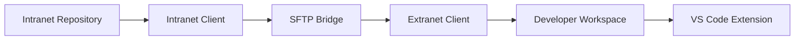
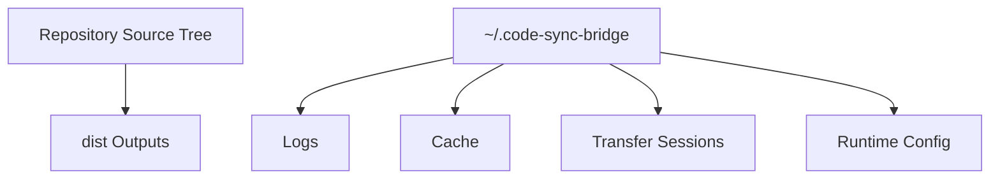
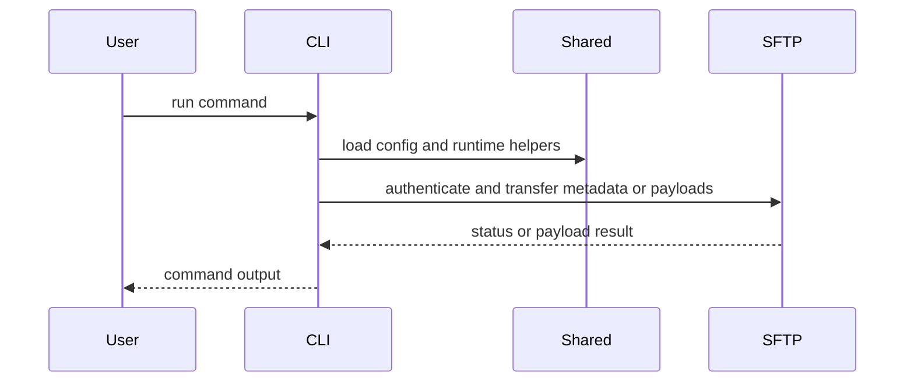
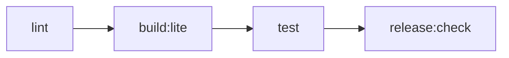

# System Flow Diagram

## Overview

The repository consists of a shared core, two CLI clients, an optional VS Code extension, and an SFTP bridge that transports code-stream payloads between isolated environments.

## High-Level Flow



## Package Relationship

```mermaid
graph TB
    Shared[@code-sync-bridge/shared]
    Intranet[@code-sync-bridge/intranet-client]
    Extranet[@code-sync-bridge/extranet-client]
    VSCode[code-sync-bridge-vscode]
    Tests[@code-sync-bridge/integration-tests]

    Shared --> Intranet
    Shared --> Extranet
    Shared --> VSCode
    Intranet --> Tests
    Extranet --> Tests
    Shared --> Tests
    Extranet --> VSCode
```

## Runtime Boundary



## CLI Flow



## Validation Flow



## Notes

- The CLI entry points are intentionally thin and delegate to command modules or services.
- Shared functionality should be consumed through documented package entry points or subpath exports.
- Runtime state should stay outside the repository tree.
